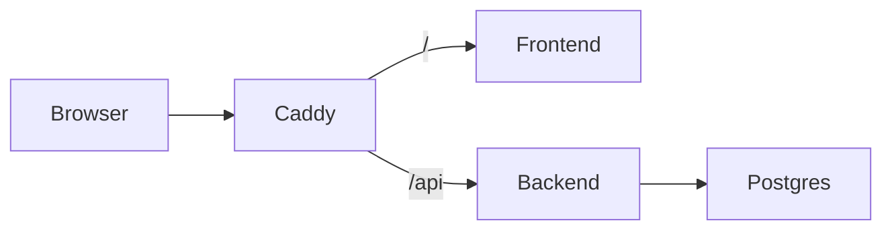

# Deployment — Travel Agent

Локальная установка без Docker: [INSTALL.md](../INSTALL.md).

## Docker Compose (рекомендуется для VPS)

Один вход через **Caddy**: HTTP/HTTPS на портах 80/443. Frontend и backend снаружи не торчат.



### 1. VPS и DNS

1. Арендуйте VPS (Timeweb, Selectel, Hetzner и т.п.) с Ubuntu 22.04+.
2. Установите Docker: https://docs.docker.com/engine/install/
3. Привяжите домен: A-запись `@` (и при желании `www`) → IP сервера.
4. Откройте порты **80** и **443** в firewall.

### 2. Код и `.env`

```bash
git clone <ваш-репозиторий> travel-agent
cd travel-agent
cp .env.example .env
nano .env
```

Обязательно задайте:

| Переменная | Пример | Зачем |
|---|---|---|
| `JWT_SECRET` | длинная случайная строка | подпись сессий |
| `LLM_API_KEY` | `sk-…` | DeepSeek |
| `SITE_ADDRESS` | `travel.example.com` | домен для Caddy / HTTPS |
| `CORS_ORIGINS` | `https://travel.example.com` | CORS (не `*` на проде) |
| `POSTGRES_PASSWORD` | сильный пароль | БД |

Локально без домена можно оставить `SITE_ADDRESS=localhost` и `CORS_ORIGINS=http://localhost,https://localhost`.

### 3. Запуск

```bash
docker compose up --build -d
```

Проверка:

- Сайт: `https://ваш-домен` (или `http://localhost`)
- Health: `https://ваш-домен/api/health` → `{"status":"ok"}`
- Логи: `docker compose logs -f caddy backend`

### 4. Прод-чеклист

- [ ] Сильный `JWT_SECRET` и `POSTGRES_PASSWORD`
- [ ] `CORS_ORIGINS` = ваш HTTPS-домен
- [ ] DNS указывает на VPS, порты 80/443 открыты
- [ ] Бэкап volume `pgdata` (и при желании `caddy_data`)
- [ ] Ключ DeepSeek с балансом

### Env (справка)

| Переменная | Обязательна | Описание |
|---|---|---|
| `JWT_SECRET` | да (прод) | Секрет JWT |
| `LLM_API_KEY` | да | Ключ DeepSeek |
| `SITE_ADDRESS` | да | Хост для Caddy |
| `CORS_ORIGINS` | да (прод) | Разрешённые origin |
| `LLM_BASE_URL` | нет | По умолчанию DeepSeek |
| `LLM_MODEL` | нет | `deepseek-chat` |
| `DATABASE_URL` | нет | В compose задаётся автоматически (Postgres) |

### Обновление

```bash
git pull
docker compose up --build -d
```
